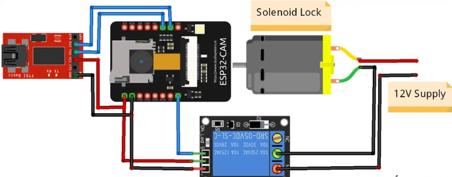
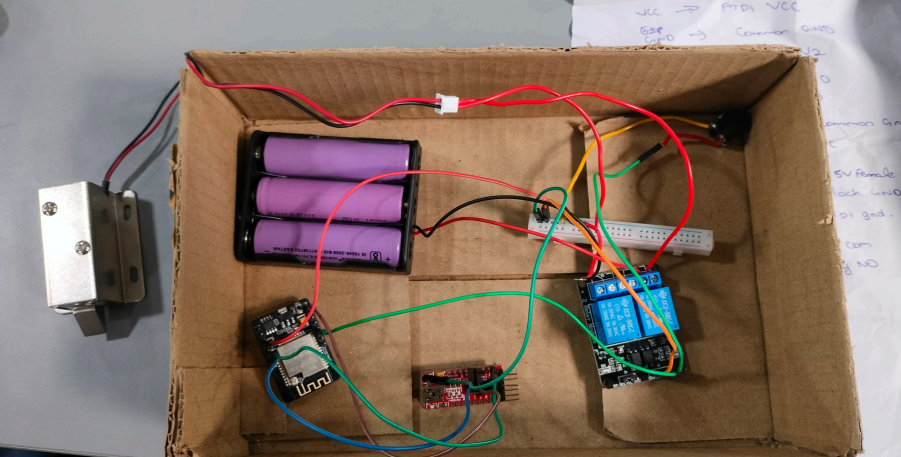
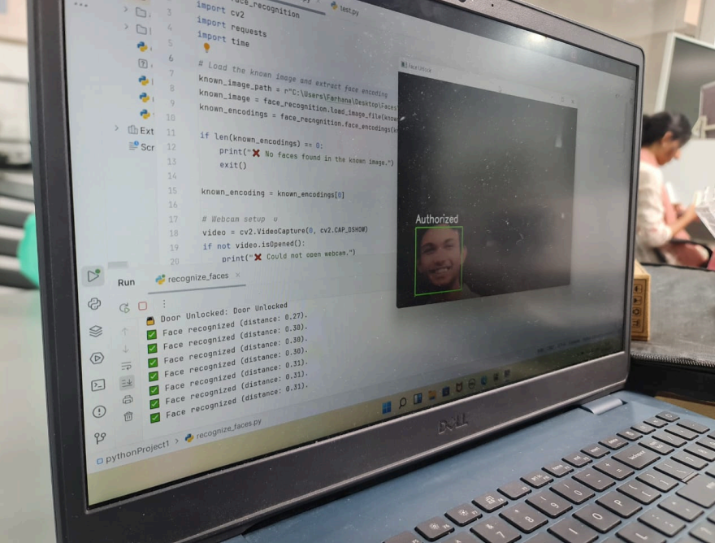

# 🔐 Face Recognition Door Unlocking System using ESP32-CAM

This project implements a **smart door unlocking system using facial recognition**. It eliminates the need for traditional keys by using **face detection and recognition** to grant access.
The system captures a live image, compares it with stored faces, and unlocks the door if a match is found.

---

## 🎯 Objectives

* To develop a secure door access system using face recognition
* To eliminate physical keys and manual access
* To integrate ESP32-CAM with relay-controlled locking
* To implement real-time face detection and recognition

---

## ⚙️ Components Used

* ESP32-CAM
* FTDI Programmer
* Relay Module
* Solenoid Lock
* 12V Battery
* Jumper Wires
* Breadboard

---

## 🧠 Technologies Used

* Python
* OpenCV
* face_recognition library
* ESP32-CAM (WiFi-enabled microcontroller)

---

## 🔧 Working Principle

The system works by capturing a real-time image using ESP32-CAM and comparing it with stored images.

* Images of authorized users are stored in a folder
* Live image is captured and processed using Python
* Face encodings are generated and compared
* If a match is found → relay is activated → door unlocks
* After a few seconds → relay turns OFF → door locks again

👉 This ensures secure and automatic access control.

---

## 🔄 System Flow

Face Capture → Image Processing → Face Matching → ESP32 Trigger → Relay → Door Unlock

---

## 💻 Python Code (Face Recognition)

```python
import face_recognition
import cv2
import requests
import time

# Load the known image and extract face encoding
known_image_path = r"C:\Users\Farhana\Desktop\Faces\priyansh.jfif"
known_image = face_recognition.load_image_file(known_image_path)
known_encodings = face_recognition.face_encodings(known_image)

if len(known_encodings) == 0:
    print("❌ No faces found in the known image.")
    exit()

known_encoding = known_encodings[0]

# Webcam setup  u
video = cv2.VideoCapture(0, cv2.CAP_DSHOW)
if not video.isOpened():
    print("❌ Could not open webcam.")
    exit()

print("✅ Webcam started. Beginning face recognition...")

last_unlock_time = 0
UNLOCK_COOLDOWN = 5  # seconds
TOLERANCE = 0.45     # Lower = stricter matching

while True:
    ret, frame = video.read()
    if not ret:
        print("❌ Failed to capture image.")
        break

    # Resize and convert to RGB
    small_frame = cv2.resize(frame, (0, 0), fx=0.25, fy=0.25)
    rgb_frame = small_frame[:, :, ::-1]

    # Detect faces
    face_locations = face_recognition.face_locations(rgb_frame)
    face_encodings = face_recognition.face_encodings(rgb_frame, face_locations)

    for (top, right, bottom, left), face_encoding in zip(face_locations, face_encodings):
        # Compare face with known face
        matches = face_recognition.compare_faces([known_encoding], face_encoding, tolerance=TOLERANCE)
        face_distance = face_recognition.face_distance([known_encoding], face_encoding)[0]

        if matches[0]:
            label = "Authorized"
            print(f"✅ Face recognized (distance: {face_distance:.2f}).")

            # Cooldown logic
            current_time = time.time()
            if current_time - last_unlock_time > UNLOCK_COOLDOWN:
                try:
                    response = requests.get("http://192.168.74.79/unlock")
                    print("🔓 Door Unlocked:", response.text)
                    last_unlock_time = current_time
                except Exception as e:
                    print(f"❌ Error: Could not connect to ESP32. {e}")
        else:
            label = "Unknown"
            print(f"❌ Unauthorized face detected (distance: {face_distance:.2f}).")

        # Scale back up face box since the frame was scaled down
        top *= 4
        right *= 4
        bottom *= 4
        left *= 4

        # Draw box and label
        cv2.rectangle(frame, (left, top), (right, bottom), (0, 255, 0) if matches[0] else (0, 0, 255), 2)
        cv2.putText(frame, label, (left, top - 10), cv2.FONT_HERSHEY_SIMPLEX, 0.8, (255, 255, 255), 2)

    # Show the webcam feed
    cv2.imshow("Face Unlock", frame)

    # Exit on 'q' key
    if cv2.waitKey(10) & 0xFF == ord('q'):
        print("👋 Exiting...")
        break

video.release()
cv2.destroyAllWindows()
```

---

## 💻 ESP32-CAM Code (Relay Control)

```cpp
#include <WiFi.h>
#include <ESPAsyncWebServer.h>

const char* ssid = "AO3";
const char* password = "a12b32";

AsyncWebServer server(80);
const int relayPin = 14;

unsigned long unlockStartTime = 0;
bool isUnlocked = false;

void setup() {
  Serial.begin(115200);

  pinMode(relayPin, OUTPUT);
  digitalWrite(relayPin, HIGH); // Locked (active LOW relay)

  WiFi.begin(ssid, password);
  while (WiFi.status() != WL_CONNECTED) {
    delay(1000);
    Serial.println("Connecting to WiFi...");
  }

  Serial.println("Connected!");
  Serial.println(WiFi.localIP());

  // Home route
  server.on("/", HTTP_GET, [](AsyncWebServerRequest *request){
    request->send(200, "text/plain", "ESP32 Door Lock System Running");
  });

  // Unlock route
  server.on("/unlock", HTTP_GET, [](AsyncWebServerRequest *request){
    digitalWrite(relayPin, LOW); // Unlock
    unlockStartTime = millis();
    isUnlocked = true;

    request->send(200, "text/plain", "Door Unlocked");
  });

  server.begin();
}

void loop() {
  if (isUnlocked && millis() - unlockStartTime >= 3000) {
    digitalWrite(relayPin, HIGH); // Lock again
    isUnlocked = false;
    Serial.println("Door Locked");
  }
}
```

---

## 🔌 Hardware Connections

### 📷 ESP32-CAM + Relay

| Component | Connection |
| --------- | ---------- |
| Relay IN  | GPIO 4     |
| Relay VCC | 5V         |
| Relay GND | GND        |

---

### 🔐 Relay + Solenoid Lock

* Relay controls power to solenoid lock
* When relay ON → door unlocks
* When relay OFF → door locks

---

## 📸 Circuit Diagram

<p align="center">
  
</p>

---

## 📸 Prototype

<p align="center">
  
</p>

---

## 📊 Results

<p align="center">
  
</p>

* Authorized users were successfully recognized
* Door unlocked within **1–2 seconds**
* System automatically relocked after delay
* Continuous monitoring enabled real-time access

---

## ✅ Applications

* Smart home security
* Office access control
* Attendance systems
* Secure entry systems

---

## 🚀 Future Enhancements

* 📱 Mobile app integration
* 🔊 Buzzer alert for unknown faces
* ☁️ Cloud-based face database
* 📊 AI model improvement (CNN)

---

## 📚 Learning Outcomes

* Computer vision using OpenCV
* Face recognition techniques
* ESP32-CAM programming
* IoT-based automation
* Hardware + software integration

---

## 📚 Conclusion

This project demonstrates a secure and efficient door unlocking system using face recognition.
It combines embedded systems and AI to create a modern access control solution.
